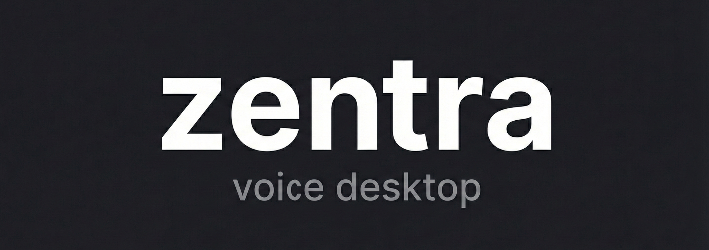
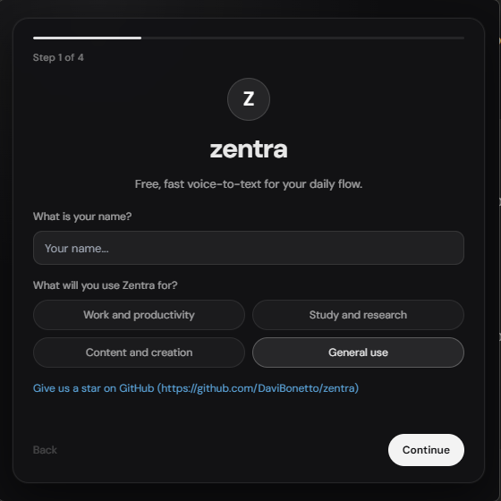
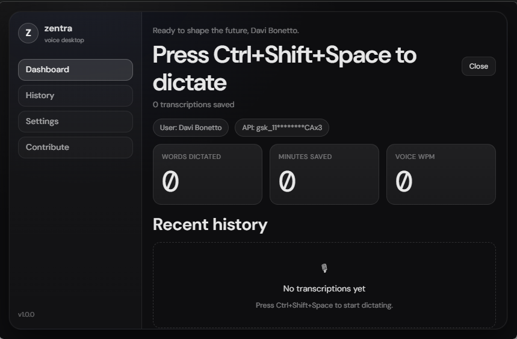
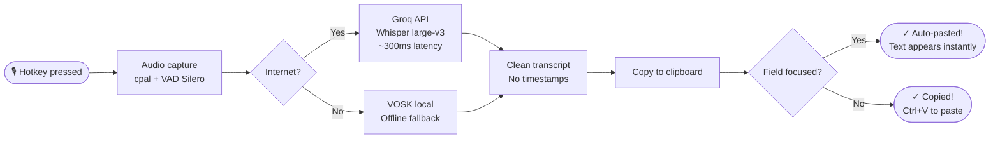
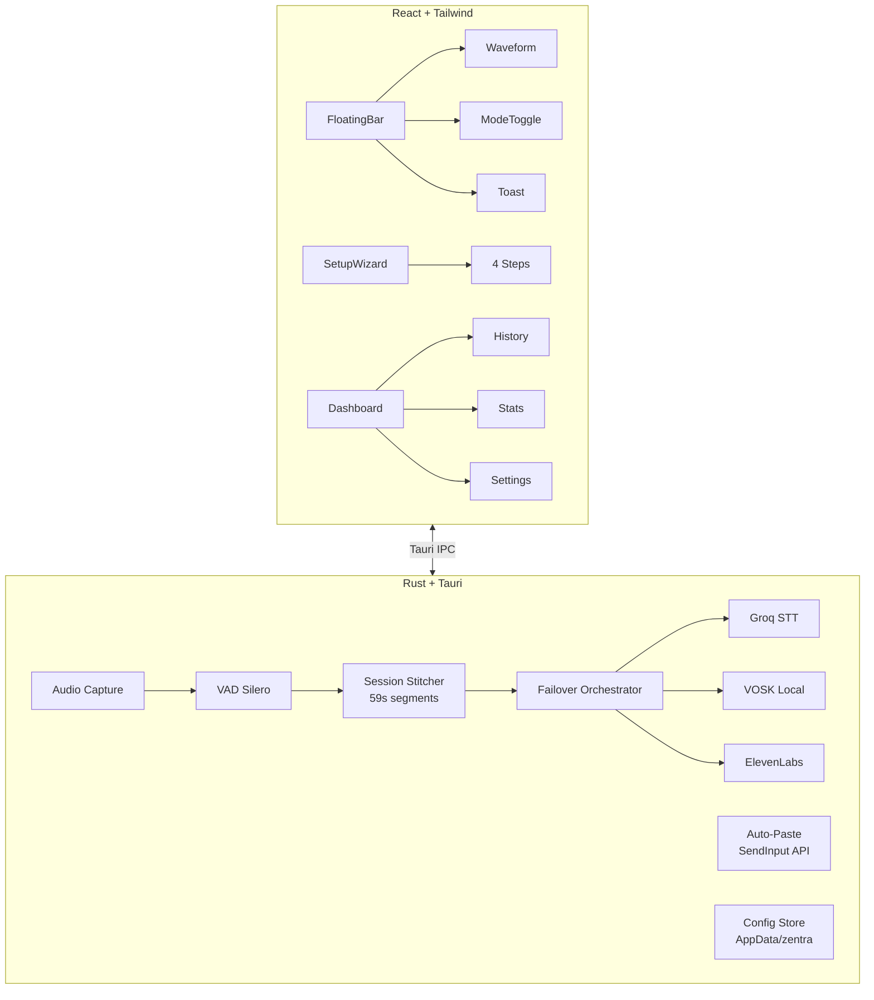

<div align="center">


<br/><br/>

[](https://github.com/DaviBonetto/zentra/releases)
[](LICENSE)
[](https://github.com/DaviBonetto/zentra/releases)
[](https://tauri.app)
[](https://groq.com)
[](https://github.com/DaviBonetto/zentra/stargazers)
[](https://github.com/DaviBonetto/zentra/issues)
[](CONTRIBUTING.md)
[](https://deepwiki.com/DaviBonetto/zentra)

<h2>zentra</h2>
<h3>Voice to text. Free. Instant. Yours.</h3>

<p>
The free, open-source alternative to Wispr Flow and Willow.<br/>
Press your hotkey → speak → text appears wherever you're typing.<br/>
No subscription. No cloud. No limits
</p>

<br/>

<a href="https://github.com/DaviBonetto/zentra/releases/latest/download/Zentra_1.0.2_x64-setup.exe">
  
</a>

<br/><br/>

<sub>🍎 macOS · 🐧 Linux — <strong>coming soon</strong></sub>

</div>

## Demo

<div align="center">

</div>

> Press `Ctrl+Shift+Space` → speak for 5 seconds → text appears in VS Code, Notion, Chrome, Discord — anywhere.

## Why Zentra?

| | Zentra | Wispr Flow | Willow |
|---|---|---|---|
| Price | **Free forever** | $10/mo | Free (limited) |
| Open Source | ✅ | ❌ | ❌ |
| Auto-paste | ✅ | ✅ | ✅ |
| Works offline | ✅ VOSK | ❌ | ❌ |
| Custom hotkey | ✅ | ✅ | ✅ |
| Dashboard + History | ✅ | ✅ | ❌ |
| No tracking | ✅ | ❌ | ❌ |
| Transcription speed | ~5–10s | ~3s | ~2s |

## Features

- 🎙 **Instant voice capture** — Global hotkey starts recording immediately
- ⚡ **Ultra-fast transcription** — Groq API (Whisper large-v3) at ~300ms latency
- 📋 **Auto-paste** — Text appears where your cursor is, no Ctrl+V needed
- 🔒 **Private by default** — API key stored locally, no cloud sync, no telemetry
- 📡 **Offline fallback** — VOSK local model when no internet available
- 🎨 **Minimal floating UI** — Glass morphism bar stays out of your way
- 📊 **Dashboard** — Track words dictated, minutes saved, full transcription history
- ⚙️ **Zero-code setup** — Guided wizard, no `.env` editing required
- 🆓 **Free Groq API** — No credit card needed, generous free tier
- 🌐 **Multi-language** — Portuguese, English, and auto-detect

## Screenshots

<div align="center">


<br/><sub>The floating bar — minimal, always-on-top, glass morphism</sub>

<br/><br/>


<br/><sub>First-run setup wizard — configure in under 2 minutes</sub>

<br/><br/>


<br/><sub>Dashboard — transcription history, stats, settings</sub>

</div>

## How It Works





## Getting Started

### Option 1 — Install (Recommended)

1. Download the installer from [Releases](https://github.com/DaviBonetto/zentra/releases)
2. Run `Zentra_1.0.2_x64-setup.exe`
3. Follow the setup wizard (2 minutes):
   - Enter your name
   - Get your **free** [Groq API key](https://console.groq.com) (no credit card)
   - Choose your hotkey (default: `Ctrl+Shift+Space`)
   - Test your microphone
4. Start dictating anywhere 🎙

### Option 2 — Build from Source

**Prerequisites:**
- Node.js 18+
- Rust (latest stable)
- Windows 10/11 (for production build)

```bash
# Clone the repository
git clone https://github.com/DaviBonetto/zentra.git
cd zentra

# Install dependencies
npm install

# Create your .env file
cp .env.example .env
# Add your GROQ_API_KEY to .env

# Run in development mode
npm run tauri:dev

# Build for production
npm run tauri:build
```

**Get your free Groq API key:**
1. Go to [console.groq.com](https://console.groq.com)
2. Create a free account (no credit card required)
3. Generate an API key
4. Paste it in the Zentra setup wizard

## Roadmap

### v1.0.2 — Current ✅
- [x] Floating bar UI with glass morphism
- [x] Groq API transcription (~5–10s)
- [x] Auto-paste via Windows SendInput
- [x] VOSK offline fallback
- [x] Setup wizard with API key validation
- [x] Dashboard with transcription history
- [x] System tray integration
- [x] Configurable hotkey

### v1.1.0 — Coming Soon 🔜
- [ ] macOS support
- [ ] Linux support
- [ ] Transcription preview before paste (edit before sending)
- [ ] Export history (CSV/TXT)
- [ ] Custom vocabulary / dictionary

### v2.0.0 — Future 🚀
- [ ] **AI Prompt Mode** — Transform speech into structured prompts for ChatGPT/Claude
- [ ] Multiple STT model options (Whisper small/medium/large)
- [ ] OpenAI API support
- [ ] Real-time transcription (streaming)
- [ ] Browser extension
- [ ] Team/workspace features

## Contributing

Contributions are **very welcome**! Zentra is built by the community, for the community.

**Ways to contribute:**
- 🐛 [Report bugs](https://github.com/DaviBonetto/zentra/issues/new?template=bug_report.md)
- 💡 [Request features](https://github.com/DaviBonetto/zentra/issues/new?template=feature_request.md)
- 🔧 Submit pull requests
- ⭐ Star the repository to help others discover it
- 🌍 Add translations

**See [CONTRIBUTING.md](CONTRIBUTING.md) for detailed guidelines.**

### Quick contribution guide:
```bash
# Fork and clone
git clone https://github.com/YOUR_USERNAME/zentra.git

# Create a feature branch
git checkout -b feat/your-feature-name

# Make your changes and test
npm run tauri:dev

# Commit using conventional commits
git commit -m "feat: add your feature description"

# Push and open a PR
git push origin feat/your-feature-name
```

## Star History

<div align="center">

## Star History

[](https://www.star-history.com/#DaviBonetto/zentra&type=date&legend=top-left)

</div>

## License

MIT © [Davi Bonetto](https://github.com/DaviBonetto)

---

<div align="center">

<sub>Built with ❤️ by <a href="https://github.com/DaviBonetto">Davi Bonetto</a></sub>

<sub>If Zentra saves you time, consider giving it a ⭐</sub>

</div>
